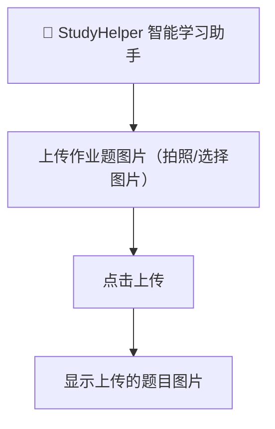
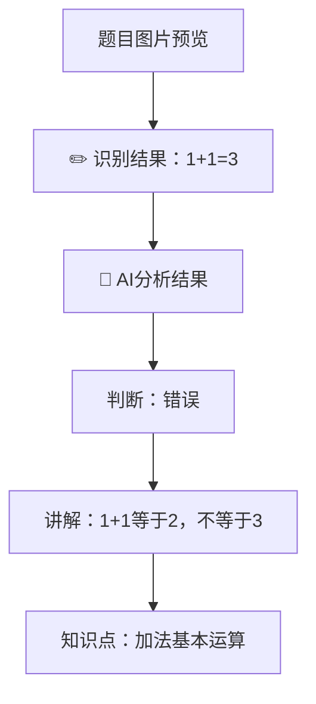
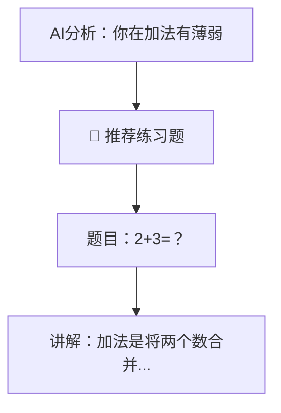
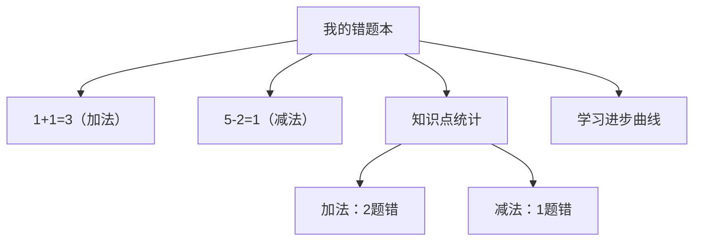
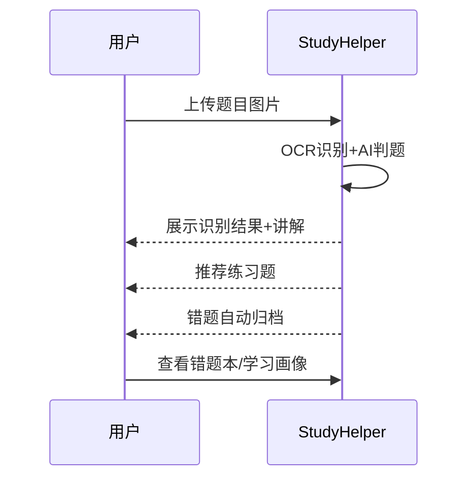
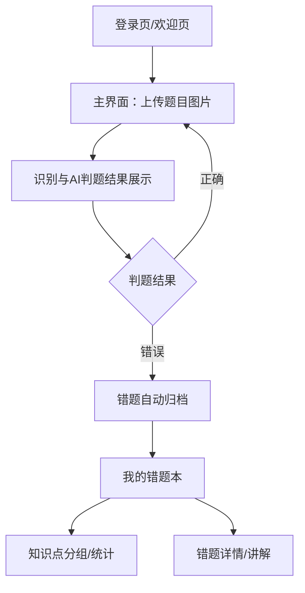
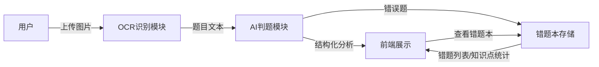

# 2024-07-11 项目路线与MVP讨论记录

## 1. 项目愿景与目标
- 做一个真正有用、可商业化、可持续优化的AI教育产品，而不是只停留在Demo或学术玩具阶段。
- 快速打磨出核心功能，后续能迁移到App/硬件端，具备演示和融资能力。
- 借鉴优秀开源项目，合理融合AI和传统方法，走“实用主义”路线。

## 2. 主要建议与讨论

### 产品路线建议
- 明确“最小可用产品”（MVP）核心：
  1. 拍照识题（OCR）+ AI判题/讲解（大模型/规则）
  2. 错题本/错题归档（自动+手动）
  3. 个性化推荐（基于错题/知识点）
  4. 简单的用户画像（错题统计、知识点掌握图谱）
  5. Web端/小程序端可用，后续迁移App/硬件
- 参考优秀开源项目：Photomath、小猿搜题、Khan Academy、Squirrel AI、Umi-OCR
- 设计“可迁移、可扩展”架构：前后端分离，核心AI逻辑/数据服务全部云端API化，多端集成

### 技术路线建议
- 现阶段：Python为主，API化各核心功能，Streamlit/Gradio快速搭建Web演示，本地JSON/SQLite存储，代码结构模块化
- 后续阶段：后端API服务化，前端多端适配，数据库升级，AI推理API优先，硬件集成
- 兼容传统方法：题库检索、推荐、统计等用传统算法，AI只用在“人做不了/做不好”的环节

### 团队与资源建议
- 小型全栈团队，充分利用开源工具和AI助手

### AI策略与可持续优化
- Prompt工程、数据闭环、模型可替换、A/B测试

### 演示与融资建议
- 演示场景：拍照识题→AI判题讲解→错题归档→个性化推荐→学情分析
- 数据可视化、用户故事、商业模式、投资人关注点

### 下一步建议
1. 梳理MVP功能清单，明确“演示版”要实现哪些场景
2. API化各核心功能，为后续多端迁移/集成打基础
3. 持续对标头部产品/开源项目，吸收其优点
4. 每开发一个功能都考虑“未来能否迁移到App/硬件”
5. 快速打磨Demo，争取早日可演示、可拉投资

---

## 3. 结论
- 先梳理MVP功能清单和优先级
- 拆解开发任务，制定技术路线图
- 推荐具体的开源项目/技术栈/API
- 辅助做演示PPT/产品文档/融资材料

---

（本记录为2024-07-11重要产品与技术路线讨论，后续有类似有意义的讨论均记录于devLog/下按日期归档）

// ... existing content ...

---

## 4. 产品预想界面与用户流程草图

### 1. 首页/上传题目界面

- 顶部LOGO和产品名
- 中间大按钮“上传作业题图片”
- 支持拍照或选择本地图片
- 上传后图片预览

### 2. 识别结果与AI判题界面

- 左侧显示题目图片
- 右侧显示OCR识别结果
- 下方展示AI判题结果（对/错）、讲解、知识点

### 3. 推荐练习题界面

- 根据知识点推荐一题
- 展示推荐题目和详细讲解

### 4. 错题本/学习画像界面

- 展示所有错题（题目+知识点）
- 知识点统计饼图/柱状图
- 学习进步曲线（错题数随时间变化）

### 5. 用户故事流程图

（本节为2024-07-11产品预想界面与用户流程草图，便于PPT/产品文档/演示使用）

已将我们刚刚的核心讨论内容完整记录到 `devLog/0711.md`，后续所有有意义的产品/技术/路线讨论都会按日期归档到 `devLog/` 下。

---

## 5. MVP页面流程与数据流草图（2024-07-11）

### 页面流程图

### 数据流草图

### 主要数据结构
- 用户信息（user_id，后续可扩展）
- 错题本（题目、AI分析、知识点、时间戳、归属用户）
- 题库/答题素材（题目、标准答案、知识点）

（本节为MVP页面流程和数据流草图，后续开发和文档均以此为蓝本）

### 下一步：MVP功能清单

#### StudyHelper MVP功能清单（最小可用产品）

1. **拍照/上传题目图片**
   - 支持用户上传作业题目图片（Web端/移动端）
2. **OCR题目识别**
   - 自动识别图片中的题目文本（PaddleOCR/云OCR）
3. **AI判题与讲解**
   - 用大模型判断题目对错，输出结构化讲解和知识点
4. **错题本/错题归档**
   - 自动归档错题，支持用户查看错题本
5. **个性化推荐**
   - 根据错题知识点推荐一题巩固练习，并给出讲解
6. **基础用户画像**
   - 展示错题统计、知识点分布、学习进步曲线（可视化）
7. **演示友好的Web界面**
   - 支持全流程演示，界面简洁，便于投资人/用户理解
8. **API化核心功能**
   - 所有AI/数据分析能力均为API接口，便于后续App/硬件集成

---

### 任务拆解（建议）

1. **前端**
   - 图片上传、结果展示、错题本页面、推荐题页面、学情可视化
2. **后端/服务**
   - OCR服务、AI判题服务、推荐服务、错题本/用户画像API
3. **数据**
   - 题库/推荐题JSON、错题本JSON、用户画像数据结构
4. **AI/算法**
   - Prompt工程、判题/讲解结构化输出、推荐算法
5. **演示材料**
   - 产品流程PPT、用户故事、对标竞品分析、商业模式草图

---

### 参考优秀项目（建议调研/借鉴）

- **Photomath**（App端体验、拍照解题、动画讲解）
- **小猿搜题**（题库、错题本、社区、移动端体验）
- **Khan Academy**（知识点图谱、个性化推荐、数据可视化）
- **Umi-OCR**（开源OCR工具，轻量本地化）
- **Squirrel AI**（自适应学习、知识点诊断）

---

### PPT建议（演示结构）

1. 产品痛点与市场机会
2. StudyHelper产品定位与核心价值
3. MVP功能流程图（拍照→识题→判题→推荐→错题本→画像）
4. 技术架构（前后端分离、API化、可多端集成）
5. 竞品对比/优势
6. Demo界面/用户故事
7. 商业模式/未来规划
8. 团队与融资需求

---

如需详细MVP任务清单、PPT大纲或竞品分析模板，请告诉我你想先做哪一部分！