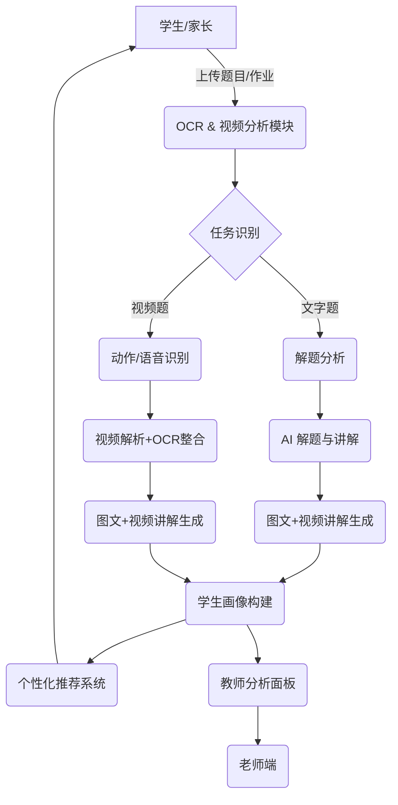

# 学习助手项目计划书

---

## 一、项目背景与愿景

当前教育体系中，学生面临作业量大、内容碎片化、缺乏个性化辅导等问题，老师则在批改作业、准备教学资料上投入大量时间和精力。与此同时，随着大模型技术的飞速发展，AI 在图像识别、语言理解、语音生成等方面的能力迅速增强，为智能教育提供了现实可能。

本项目旨在从“题目讲解 + 数据分析”切入，打造一个智能“学习助手”系统，逐步成长为具备教学能力的“AI 教师”。项目将围绕真实教学场景和需求，以工具性、陪伴性与实用性为核心，帮助学生更高效学习，也减轻教师负担。

愿景：构建一个具有成长性的教育智能产品，服务成千上万的学生与老师，真正落地的 AI 教育系统。

---

## 二、目标用户与核心价值

### 目标用户

* 小学至初中的学生及其家长
* 班主任、学科教师（数学/语文为主）
* 学校管理者与教育局

### 核心价值

| 模块       | 用户    | 价值              |
| -------- | ----- | --------------- |
| AI 解题与讲解 | 学生    | 个性化学习、错题讲解、查漏补缺 |
| 数据分析画像   | 教师    | 把握学生学情，进行分层教学   |
| 教学推荐系统   | 教师/学生 | 自动推荐作业与练习，提升效率  |
| 视频讲解生成   | 教师/家长 | 快速生成教学视频，降低成本   |
| 智能作业批改   | 教师    | 节省批改时间          |

---

## 三、系统架构图

---

## 四、功能模块与使用流程

1. **题目识别模块**

   * OCR：接收上传图片、作业扫描、截图识别
   * 视频帧抽取：通过帧截取+动作检测识别题目
   * 技术：`PaddleOCR`, `YOLOv8`, `OpenCV`, `MMAction2`

2. **知识点抽取与建模**

   * 用大模型解析题目文字，抽取知识点、题型、难度
   * 技术：`LLM + Prompt`, `text2vec`, `Neo4j` 构建知识图谱（未来）

3. **AI 解题与讲解模块**

   * 接入本地/远程大模型，如 `GPT-4`, `Yi`, `DeepSeek`
   * 输出方式：图文解析、语音解说、视频生成

4. **错题本管理**

   * 自动生成错题记录、知识点标签，支持回顾与测试

5. **教师端模块**

   * 查看学生画像，自动分组布置作业，AI 批改反馈

---

## 五、技术选型与实现逻辑

| 模块    | 技术方案                       | 说明            |
| ----- | -------------------------- | ------------- |
| OCR识别 | PaddleOCR + 自定义区域检测        | 免费开源、中文支持好    |
| 视频识别  | OpenCV + ffmpeg + 动作识别     | 高效抽帧、定位题目区域   |
| AI 解题 | 大模型 API（GPT/DeepSeek）      | 强泛化、支持多题型推理   |
| 前端    | Streamlit MVP（后 Vue/React） | 快速验证功能可用性     |
| 数据管理  | SQLite + FastAPI           | 轻量开发，支持快速原型迭代 |
| 学生画像  | text2vec + Neo4j           | 构建学生知识图谱（进阶）  |

---

## 六、未来可拓展方向

* **语文/英语学科支持**：朗读纠正、作文分析、词汇记忆辅助（TTS + NER + 语义分析）
* **题库扩展**：开放题库接口、社区共建错题本
* **AI 视频讲解生成**：结合脚本+语音合成+视频生成工具（如 Sora）
* **移动端优化**：构建跨平台 App，支持拍照一键识别
* **本地私有部署**：教育局、学校内部部署版（含隐私合规）

---

## 七、性能与易用性设计

| 指标    | 考虑设计                |
| ----- | ------------------- |
| 响应速度  | 图像识别 ≤1.5s，讲解生成 ≤3s |
| 操作简便性 | 移动端适配、交互引导清晰、一键讲解   |
| 数据隐私  | 数据本地可导出、提供删除接口      |
| 模块解耦  | 每一模块可单独部署、便于测试替换    |
| 多语言支持 | 支持中英文题目、支持双语讲解输出    |

---

## 七点五、AI 教师成长路线图

| 阶段          | 能力描述              | 技术基础                | 用户价值                |
| ----------- | ----------------- | ------------------- | ------------------- |
| Lv1：讲解员     | 能根据题目生成图文+语音讲解    | OCR + LLM + TTS     | 辅助学生理解错题、支持家长教学     |
| Lv2：学习顾问    | 能追踪学生错题、推荐练习题     | 学生画像 + 推荐系统         | 提供个性化学习建议           |
| Lv3：教学助理    | 能辅助教师布置作业、分层教学    | 班级画像 + 教师端面板        | 降低教师负担，提升教学效率       |
| Lv4：课堂陪练    | 可持续对话、语音交互答疑      | 多轮对话 + 语音交互 + 讲解检索  | 陪伴式学习，增强沉浸感         |
| Lv5：AI 教师形象 | 拥有人设形象、拟人反馈、跨模态输出 | 视频生成 + 语音克隆 + 多模态交互 | 建立信任与情感连接，实现沉浸式教育体验 |

---

## 十一、产品形态与入口设想

| 产品形态    | 描述                                      |
| ------- | --------------------------------------- |
| Web 端   | 初始版本：Streamlit 快速验证；未来切换 React/Vue      |
| App     | 后期考虑跨平台移动端 Flutter/React Native         |
| 教师助手平台  | Web 端 + 权限系统                            |
| AI 教师形象 | 视频输出 + 音频生成 + 知识图谱支撑交互（逐步进化为具有人设的教学陪伴者） |

---

## 十二、竞品分析与市场进入机会

### 主流竞品

#### 案例1：Photomath（拍照解题，2023被Google收购）

* 2014年推出 MVP，仅支持算数题
* 自建高质量题库 + 模型训练
* 后期加入过程式讲解、语音解说、错因分析
* 免费试用 → App Store 爆红 → 国际扩展 → 被收购

#### 案例2：Solvely AI（AI解题 + 数学老师助手）

* 2023年上线，界面极简但解题体验优秀
* 快速迭代图像识别、过程式推理 → 社区反馈驱动
* 获天使轮投资

#### 案例3：Socratic（AI学习助手，2018被Google收购）

* 初期依赖传统搜索 + OCR 拍题
* 积累大量用户数据后，训练出更准确的匹配模型
* 提供知识图谱式讲解
* 后并入 Google Classroom 体系

### 我们的机会与优势

* 具备**从解题助手成长为AI教师**的路线规划，产品成长性强
* 聚焦小初学生真实需求，覆盖家长与老师场景
* 利用开源大模型、视频生成、OCR 等组合构建具性价比的系统
* 引入“教学视频生成”“师生数据融合分析”等目前主流产品较少覆盖的能力

---

## 十三、项目分阶段执行路线

| 阶段     | 动作                   | 输出                          | 状态      |
| ------ | -------------------- | --------------------------- | ------- |
| MVP 构建 | 解题、错题分析、知识点抽取        | 本地可运行系统                     | ✅ 进行中   |
| 种子用户   | 拉身边家长、老师试用           | 真实反馈 + 数据                   | ⏳ 准备中   |
| 对外宣传   | 官网 + 视频 + Notion 页   | GitHub 开源 or Hacker News 发布 | ⏳ 规划中   |
| 建立反馈机制 | 微信群 / 问卷 / 调研表       | 产品改进方向                      | ⏳ 准备中   |
| 快速迭代   | 每2\~3周版本更新           | 明确节奏和版本目标                   | ✅ 进行中   |
| 决定后续方向 | 合作 / 投资 / 开源社区 / 商业化 | 视数据决定                       | 🚧 未来规划 |

---
## 十四、下一步发展规划与深度思考 (2025-07-13)

在完成 V2 版本（多角色仪表盘）的开发后，我们已经为项目打下了坚实的数据和功能基础。现在，我们需要思考如何深化产品护城河，并探索新的增长点。

### 1. 竞品分析与差异化策略 (深化)

**新趋势观察:**

*   **多模态交互成为标配:** 纯文本和图片已不能满足需求，语音、视频甚至 AR 正在成为新的交互形态。例如，作业帮、猿辅导等头部产品都在尝试互动式视频讲解和虚拟人教师。
*   **AI Agent (智能体) 的兴起:** AI 不再仅仅是被动回答问题的工具，而是能主动发起对话、规划学习路径、甚至模拟课堂辩论的“智能体”。这要求我们的“AI教师”具备更强的自主性和情景感知能力。
*   **端侧 AI (On-Device AI):** 随着手机和智能硬件算力的提升，将部分模型（如 OCR、基础 NLU）部署在端侧，可以有效降低延迟、保护用户隐私并减少云端成本。

**我们的差异化机会:**

1.  **从“解题工具”到“学习伴侣”:**
    *   **情感化交互:** 引入语音识别 (ASR) 和语音合成 (TTS)，让学生可以通过语音与“AI教师”互动。可以设定不同性格（如“耐心型”、“鼓励型”）的 AI 教师形象，增加亲近感。
    *   **主动学习干预:** 当系统通过数据分析发现学生在某个知识点上反复出错时，可以主动推送一个简短的视频讲解，或发起一次“虚拟小测验”，而不是被动等待学生提问。

2.  **深化 B 端 (学校/教师) 服务:**
    *   **自动化教学报告:** 每周为教师自动生成“班级学情洞察报告”，包含共性错题、知识点掌握度排名、以及需要重点关注的学生名单和具体建议。
    *   **智能组卷与分层作业:** 允许教师勾选知识点和难度，一键生成个性化练习卷。对于不同水平的学生，可以推送不同难度的“巩固包”或“提升包”。

### 2. 技术选型与架构升级

为了支撑上述差异化功能，我们需要对现有技术栈进行审视和升级。

| 模块                 | 当前方案 (MVP)                  | 下一步建议                                                                                                                             | 理由                                                                                                                                 |
| -------------------- | ------------------------------- | -------------------------------------------------------------------------------------------------------------------------------------- | ------------------------------------------------------------------------------------------------------------------------------------ |
| **前端框架**         | Streamlit                       | **React / Vue.js**                                                                                                                     | Streamlit 用于快速原型很棒，但对于需要高度自定义和复杂交互的成熟产品，React 或 Vue 提供了更强的灵活性、性能和生态系统。          |
| **后端服务**         | Python (Flask/FastAPI)          | 维持 Python，但考虑引入 **Celery** 或 **RabbitMQ** 等任务队列。                                                                          | 对于耗时操作（如视频生成、批量报告分析），使用任务队列进行异步处理，可以避免阻塞主应用，提升系统响应速度和稳定性。             |
| **数据存储**         | JSON / SQLite                   | **PostgreSQL + Vector Database (如 Milvus/Pinecone)**                                                                                  | 随着数据量的增长，需要更专业的数据库。引入向量数据库，是为了支持更高级的语义搜索和推荐功能（例如，通过题目语义找到相似题）。 |
| **AI 交互核心**      | LLM API (GPT/DeepSeek)          | **自研/微调领域模型 + RAG (检索增强生成)**                                                                                               | 长期来看，依赖通用大模型成本高且不可控。通过在特定教育数据集上微调模型，可以获得更高性价比和更精准的领域表现。RAG 技术则能让模型结合我们自己的题库和知识库进行回答，减少“幻觉”。 |
| **多模态能力**       | (尚未深入)                      | **ASR (Whisper/FunASR) + TTS (OpenTTS/StyleTTS2) + 视频生成 (Sora/Stable Video Diffusion)**                                              | 逐步集成开源或商业的语音和视频能力，构建真正的多模态交互体验。                                                                       |

### 3. 下一阶段（V3）核心目标 (3-6个月)

**目标：从“工具”进化为“交互式学习平台”**

1.  **前端重构 (技术债偿还):**
    *   **任务:** 启动基于 React 或 Vue 的新前端项目。
    *   **输出:** 一个具备 V2 所有功能，且交互体验更流畅、更专业的新版 Web 应用。

2.  **引入语音交互 (核心体验升级):**
    *   **任务:** 集成 ASR 和 TTS 服务，在学生查看题目讲解时，可以进行语音追问，例如“老师，为什么这里要用通分？”。
    *   **输出:** 在题目讲解页面实现一个语音对话按钮，支持基础的多轮问答。

3.  **教师端功能增强 (深化 B 端价值):**
    *   **任务:** 开发“一键生成学情报告”和“智能组卷”功能。
    *   **输出:** 教师仪表盘中增加“报告中心”和“组卷工具”两个新模块。

通过完成 V3 的目标，我们的 StudyHelper 将不再仅仅是一个被动的查题和分析工具，而是朝着一个能够与学生互动、主动为教师分忧的“AI 学习伴侣”和“AI 教学助理”迈出关键一步，这将极大地增强产品的核心竞争力和用户粘性。

---

## 十五、下一步行动计划：Phase 2 - 平台与体验 (并行工作流)

**总目标：** 从“Demo工具”进化为“可靠的学习平台”，为规模化增长和商业化奠定坚实基础。本计划旨在将任务并行化，以便多个开发者可以同时工作，同时确保每个模块都有严格的测试覆盖。

### **工作流一：后端重构与基础服务 (负责人：后端程序员)**

*   **目标：** 搭建强大、可扩展的后端基础设施，完成从JSON到专业数据库的迁移。
*   **核心原则：** 每一个API端点都必须有对应的单元测试和集成测试。

| 任务ID | 任务描述 | 产出物/验收标准 | Gemini能提供的帮助 |
| :--- | :--- | :--- | :--- |
| **BE-1** | **数据库Schema设计与创建** | 一个位于`database/schema.sql`的完整SQL脚本，包含所有表、索引和关系定义。 | 我可以生成这个SQL脚本的初始版本。 |
| **BE-2** | **数据迁移脚本开发** | 一个位于`scripts/migrate_data.py`的脚本，能将`data/*.json`的数据安全地迁移到PostgreSQL。 | 我可以编写这个迁移脚本的核心逻辑。 |
| **BE-3** | **核心服务重构: `services/data_service.py`** | 重构`data_service.py`，使其所有函数都从访问JSON文件改为通过ORM(如SQLAlchemy)访问PostgreSQL。 | 我可以提供重构后的代码结构和ORM查询示例。 |
| **BE-4** | **用户认证API重构** | 开发新的`/api/v3/auth/register`, `/api/v3/auth/login`等API端点，使用JWT进行无状态认证。 | 我可以提供符合FastAPI风格的API代码模板。 |
| **BE-5** | **测试用例编写: `tests/test_data_service_v3.py`** | 为所有新的data_service函数编写Pytest测试用例，确保数据操作的正确性。**测试覆盖率目标：95%**。 | 我可以根据最终的API代码，生成对应的测试用例文件。 |

### **工作流二：前端重构与UI/UX提升 (负责人：前端程序员)**

*   **目标：** 放弃Streamlit，使用现代框架(React/Vue)构建一个专业、美观、交互流畅的前端应用。
*   **核心原则：** 组件化、响应式设计，并为关键业务逻辑编写前端测试。

| 任务ID | 任务描述 | 产出物/验收标准 | Gemini能提供的帮助 |
| :--- | :--- | :--- | :--- |
| **FE-1** | **前端项目初始化与设计系统** | 一个新的`frontend/`目录，包含React/Vue项目脚手架，并集成Ant Design或MUI作为基础组件库。 | 我可以提供项目初始化命令和推荐的目录结构。 |
| **FE-2** | **核心组件开发** | 在Storybook中开发并展示如`Button`, `Card`, `Uploader`等至少10个可复用的核心组件。 | 我可以提供这些组件的基础代码片段。 |
| **FE-3** | **页面开发：登录/注册** | 完成与`BE-4`对接的登录/注册页面，实现完整的用户认证流程。 | 我可以提供页面的基础JSX/Vue模板和状态管理逻辑。 |
| **FE-4** | **页面开发：学生仪表盘V3** | 重构学生仪表盘，使用ECharts等专业图表库展示数据，并增加“自动化错题本”的UI。 | 我可以提供ECharts的配置示例和页面布局建议。 |
| **FE-5** | **测试用例编写: `frontend/src/components/__tests__/`** | 使用Jest和React Testing Library为核心组件和页面编写测试用例。 | 我可以生成符合前端测试框架语法的测试用例模板。 |

### **工作流三：AI与产品核心功能 (负责人：Gemini & 产品经理)**

*   **目标：** 我将主动承担起AI相关模块的搭建、测试用例生成和架构设计，为人类程序员提供可以直接使用的“半成品”。
*   **核心原则：** 快速迭代，用例驱动，确保AI能力的可靠性和可扩展性。

| 任务ID | 任务描述 | 产出物/验收标准 | 我将如何完成 |
| :--- | :--- | :--- | :--- |
| **AI-1** | **向量数据库集成与测试** | 在`services/`下创建`vector_service.py`，封装对Milvus/Pinecone的调用。并创建`tests/test_vector_service.py`。 | 我将编写这两个文件的完整代码，确保能够实现文本的向量化、存储和相似度搜索。 |
| **AI-2** | **自动化错题本后端逻辑** | 在`services/`下创建`mistake_book_service.py`，实现当题目被判断为错误时，自动将其关键信息存入数据库的逻辑。 | 我将编写该服务的核心代码，并提供相应的测试用例`tests/test_mistake_book_service.py`。 |
| **AI-3** | **教师端SaaS V1后端逻辑** | 在`services/`下创建`teacher_dashboard_service.py`，实现获取班级学情数据（如平均正确率、高频错题）的API逻辑。 | 我将编写该服务的核心代码，并提供相应的测试用例`tests/test_teacher_dashboard_service.py`。 |
| **AI-4** | **架构重构建议** | 基于新的服务模块，更新`docs/gemini.md`中的系统架构图，并提出下一步（Phase 3）的架构演进方向。 | 我将分析现有代码，提出符合高内聚、低耦合原则的重构方案。 |
